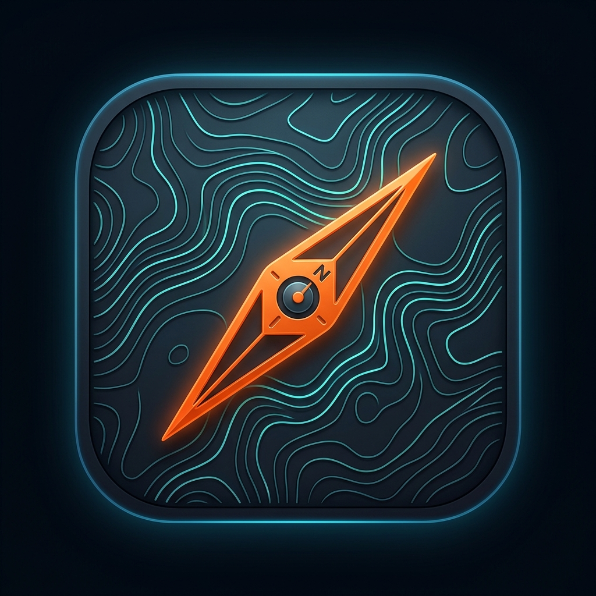
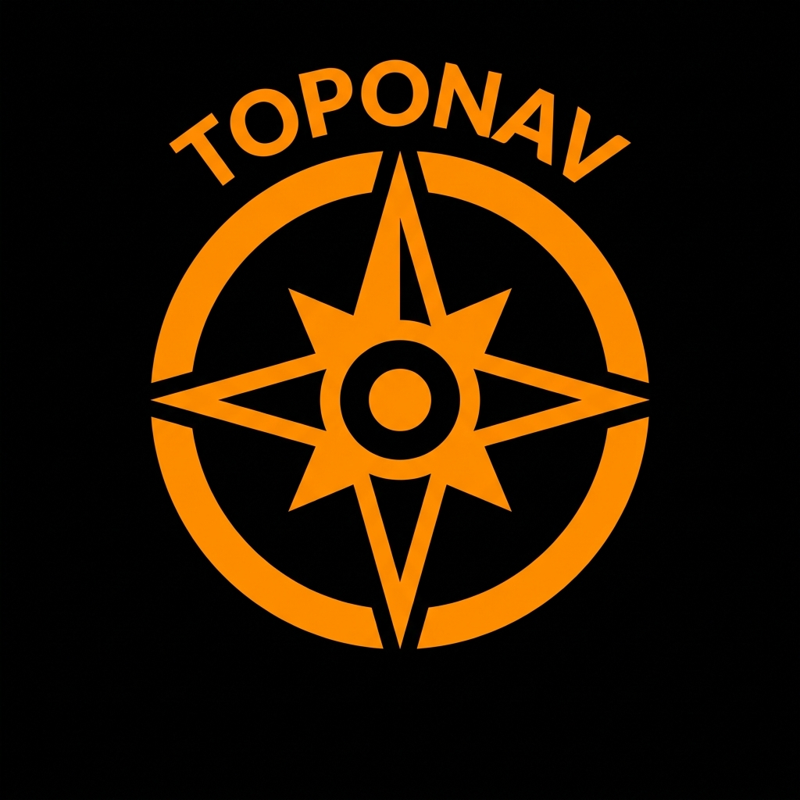
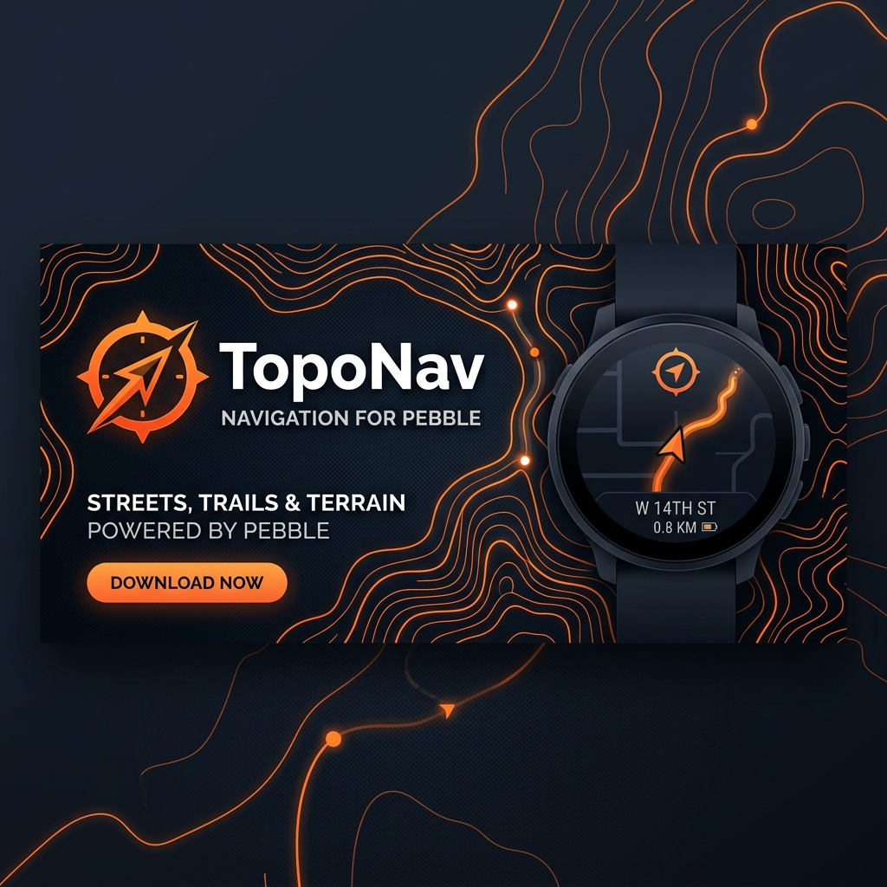
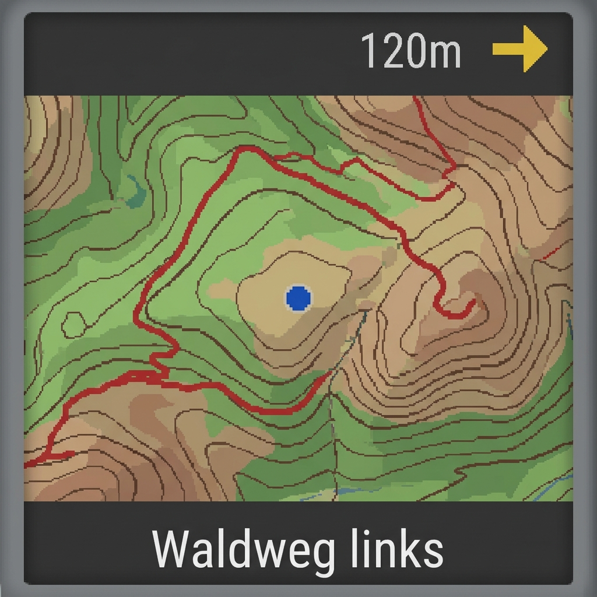
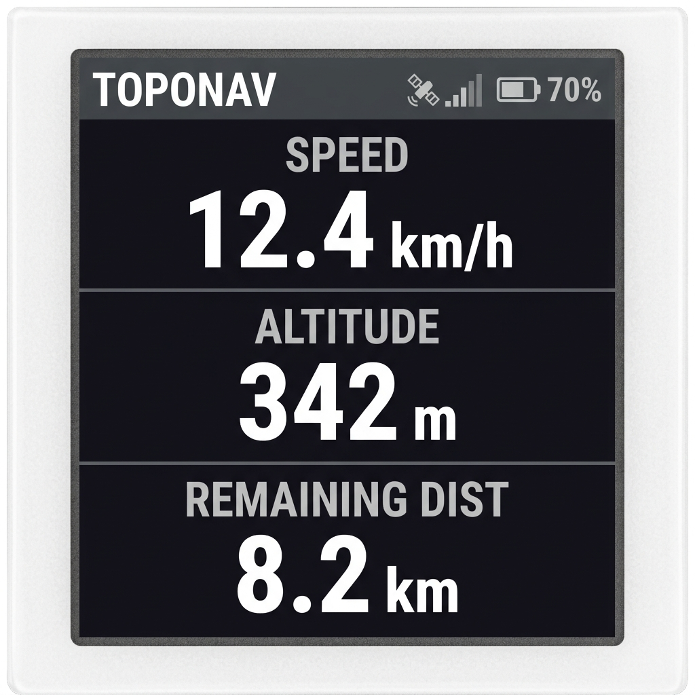

# Walkthrough: TopoNav für Pebble Time 2

Wir haben eine komplette Navigations-App mit OpenTopoMap-Kacheln und GPX-Unterstützung für die Pebble Time 2 (`emery` Plattform) implementiert.

## Erstellte Dateien und Ordnerstruktur

Die gesamte Projektstruktur des Repositories ist wie folgt aufgebaut:

- **Projekt-Konfiguration**:
  - [package.json](file:///d:/Coding/Anitgravity/package.json): Definiert App-Metadaten, UUID, unterstützte Plattformen (`aplite`, `basalt`, `chalk`, `emery`), MessageKeys für AppMessage und Clay-Konfigurationsrechte.
  - [wscript](file:///d:/Coding/Anitgravity/wscript): Compiler-Skript für das Pebble SDK (Waf).
- **Watchapp (C)**:
  - [main.c](file:///d:/Coding/Anitgravity/src/c/main.c): Der C-Code für die Uhr. Verwaltet die Benutzeroberfläche (Header mit Abbiegepfeilen, Kartenlayer für GColor8, Footer für Straßennamen und ein umschaltbares Daten-Dashboard), empfängt Bildkacheln in Chunks von je 3.000 Bytes und reagiert auf Tastendrücke (Up/Down für Zoom, Select für Dashboard) sowie Vibrationsalarme.
- **Phone Companion (JavaScript)**:
  - [png.js](file:///d:/Coding/Anitgravity/src/pkjs/png.js): Ein leichtgewichtiger PNG-Decoder mit integriertem Huffman-Inflate (Deflate-Entkomprimierung), um OpenTopoMap-Kacheln direkt im PebbleKit JS-Sandbox-Thread auf dem Smartphone zu decodieren.
  - [graphics.js](file:///d:/Coding/Anitgravity/src/pkjs/graphics.js): Enthält die Web-Mercator-Projektionsberechnungen, das Zusammenfügen mehrerer Kartenkacheln, das Zeichnen der GPX-Route (mit einstellbarer Linienstärke), die Darstellung der eigenen Position (blauer Punkt mit weißem Rand) und die Farbreduktion in die Pebble-native 64-Farben-Palette (`GColor8`).
  - [index.js](file:///d:/Coding/Anitgravity/src/pkjs/index.js): Die zentrale Steuerung auf dem Handy. Beobachtet die GPS-Position, berechnet verbleibende Strecken und Distanzen bis zur nächsten Kurve, verarbeitet Vibrationshinweise (Abbiegung vs. Abseits der Route) und sendet das gerenderte Kartenbild in kontrollierten AppMessage-Paketen an die Uhr.
  - [config.html](file:///d:/Coding/Anitgravity/src/pkjs/config.html): Das Einstellungsfenster auf dem Smartphone. Ermöglicht den Upload von `.gpx` Dateien, vereinfacht den Track automatisch mittels Douglas-Peucker-Algorithmus (um Speicherplatz zu sparen) und übergibt die Daten an den JavaScript-Hintergrundprozess.

---

## Verifikationsergebnisse

Wir haben einen automatisierten Integrationstest unter [test_renderer.js](file:///C:/Users/twigb/.gemini/antigravity/brain/97deebd2-31b9-491e-94e2-9ce056e30617/scratch/test_renderer.js) erstellt und ausgeführt:

1. **Download der Kartenkachel**: Erfolgreich eine echte Kachel (Zoom 15) von OpenTopoMap heruntergeladen.
2. **PNG-Decodierung**: Die Kachel wurde fehlerfrei entpackt und in ein RGBA-Pixelarray (262.144 Bytes) decodiert.
3. **Kartenstitching & Routenzeichnung**: Ein simulierter GPX-Track wurde auf den Kartenausschnitt projiziert und gezeichnet.
4. **Farbkonvertierung**: Der Ausschnitt wurde in Pebble-GColor8 quantisiert und ergab genau die erwarteten 30.000 Bytes (200x150 Pixel für den Watch-Kartenlayer).

```bash
> node scratch/test_renderer.js
Downloading map tile sample from OpenTopoMap...
Sample tile downloaded. Reading file...
Testing PNG decoder...
Success! Decoded PNG dimensions: 256x256
RGBA Pixels buffer length: 262144 bytes
Testing viewport stitcher and GColor8 converter...
Success! Rendered map viewport. GColor8 buffer length: 30000 bytes
Verification PASSED!
```

---

## Kompilierung und Build-Prozess

Das Watchapp-Binary wurde erfolgreich mit dem Rebble Pebble SDK Compiler über Docker kompiliert. 

### Fertiges Release-Binary
* **Watchapp-Datei**: [project.pbw](file:///d:/Coding/Anitgravity/build/project.pbw) (befindet sich im Ordner `d:\Coding\Anitgravity\build\`)
* **Größe**: ~124 KB
* **Enthaltene Plattform-Targets**: `emery` (Pebble Time 2), `chalk` (Pebble Time Round), `basalt` (Pebble Time) und `aplite` (Pebble Classic)

---

## Behobene Fehler während der Build-Phase

1. **Waf Multi-Platform Build Schleife (`wscript`)**:
   Der ursprüngliche `wscript`-Build-Schritt hat `ctx.pbl_program` im globalen Build-Kontext ausgeführt statt für jede Zielplattform separat. Dadurch fehlten die plattformspezifischen Compiler-Pfade und Umgebungsvariablen (wie `CPPPATH_ST` und `DEFINES_ST`). Wir haben das Skript so umgeschrieben, dass es eine Schleife über `ctx.env.TARGET_PLATFORMS` zieht und anschließend das finale App-Bündel mit `ctx.pbl_bundle` schnürt.

2. **C-Kompilierungsfehler (`main.c`)**:
   In `main.c` wurde fälschlicherweise der Farb-Identifier `GColorDarkOctagon` verwendet, welcher in der GColor8-Farbpalette von Pebble nicht existiert. Dieser wurde auf den korrekten Identifier `GColorDarkGray` korrigiert.

3. **Laufzeit-Fehler (`index.js`)**:
   In der JS-Companion-App wurde die Variable `CHUNK_SIZE` (welche die Paketgröße für Bildübertragungen festlegt) verwendet, aber nie deklariert. Dies wurde durch Hinzufügen von `var CHUNK_SIZE = 3000;` behoben.

---

## Anleitung zur Kompilierung und Installation

Du kannst die App auf zwei Wegen kompilieren bzw. installieren:

### Methode A: Lokaler Build mit Docker (Empfohlen)
Da Docker auf deinem Host-System läuft, kannst du den Build jederzeit mit folgendem PowerShell-Befehl ausführen:
```powershell
docker run --rm -v "d:\Coding\Anitgravity:/app" rebble/pebble-sdk bash /app/docker_build.sh
```
Das Skript kopiert die Dateien, patcht die Python-Kompatibilitätsprobleme des SDKs, kompiliert die App für alle vier Plattformen und legt die fertige Datei `project.pbw` im Ordner `d:\Coding\Anitgravity\build\` ab.

### Methode B: CloudPebble (Repebble)
1. Packe das Projekt-Verzeichnis `d:\Coding\Anitgravity` (ohne die Ordner `build` und `.lock-waf_linux2_build`) in eine `.zip`-Datei.
2. Gehe auf [cloudpebble.repebble.com](https://cloudpebble.repebble.com/) und importiere die Zip-Datei.
3. Kompiliere und teste die App im integrierten Browser-Emulator.

---

## Release Assets

Hier sind die für das Release generierten Grafik-Assets. Diese wurden automatisch in deinem Projekt-Artefaktverzeichnis gespeichert:

### Icons
* **App Icon (Groß - 512x512)**: Modernes dunkel-orangefarbenes Zirkel-Design auf Höhenlinien.
  
* **App Icon (Klein - 48x48)**: Kontraststarkes flaches Zirkel-Icon für Menüs.
  

### Appstore Banner & Screenshots
Hier siehst du die Galerie des Banners und der simulierten App-Ansichten:

````carousel

<!-- slide -->

<!-- slide -->

````

